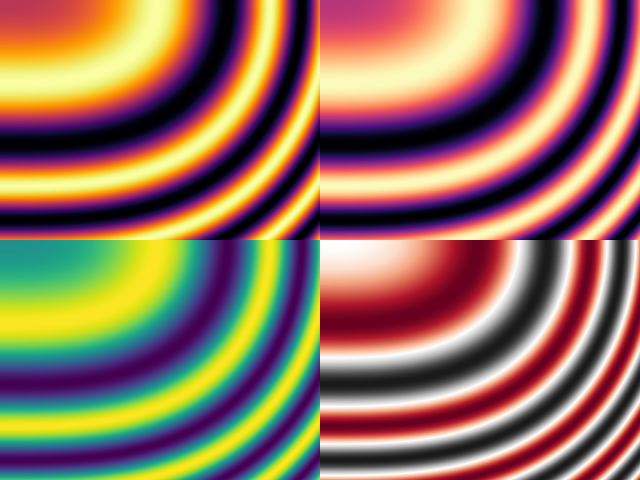

# palettes

Color palettes for golang plots



## Features

- Some 'well-known' palettes implemented, such as Viridis, Magma, Inferno
- Supports custom palettes
- Low CPU overhead: palette colors are stored in a lookup table

## Example usage

```
import "github.com/cowdude/palettes"

//build a palette lookup table during init
var palette = palettes.Definition{
    Base:      palettes.Viridis,
    MinColors: 256,
}.Build()

//use the palette
func main() {
    inputValue := 0.123 // range [0; 1]
    sample := palette.Sample() //returns a color.Color
    fmt.Println(sample)
}
```
